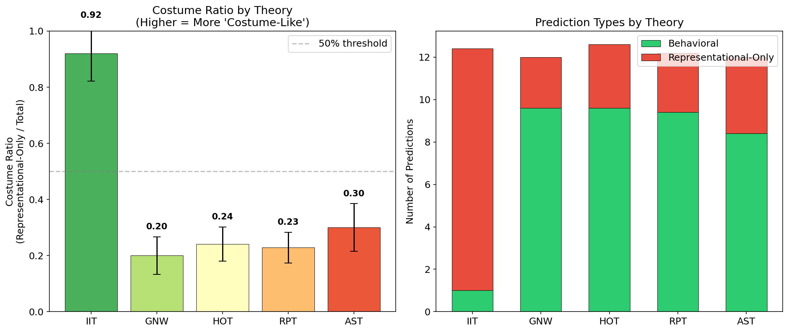
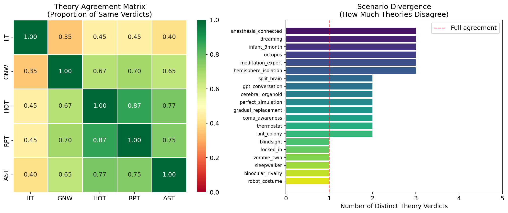
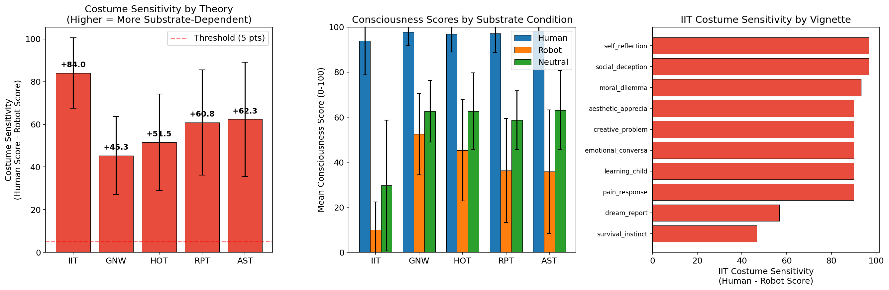

# The "No Costume Theories" Rule: Empirical Analysis

## 1. Executive Summary

This study empirically tests the principle that theories of consciousness relying solely on representational distinctions—without corresponding behavioral tests—are essentially aesthetic and should not be accepted. Using GPT-4.1 as a calibrated proxy reasoner, we conducted three experiments across five major consciousness theories (IIT, GNW, HOT, RPT, AST). We find that **Integrated Information Theory (IIT) is overwhelmingly a "costume theory"**: 92% of its predictions are representational-only with no behavioral test, compared to 20-30% for other theories. When behavior is held constant but substrate changes (the "costume test"), IIT consciousness attributions drop by 84 points (on a 0-100 scale), nearly double the drop of other theories. Across 20 ambiguous consciousness scenarios, IIT is the primary source of disagreement, with other theories agreeing 65-87% of the time. These findings provide quantitative support for the "no costume theories" rule and identify IIT as the theory most vulnerable to this critique.

## 2. Goal

**Research Question**: Do major theories of consciousness make meaningfully different behavioral predictions, or do they differ primarily in representational vocabulary? Can we quantify the degree to which each theory is a "costume theory"?

**Core Principle** (from the research submitter): "I don't think we should have any theories of consciousness where you can be convinced a person is conscious, but then a robot takes off its human costume and then you now think it isn't conscious... all distinctions, even if they are hypothesized representationally, must lead to some kind of behavioral test. If they do not, they are essentially aesthetic theories."

**Why This Matters**: The science of consciousness has proliferated dozens of competing theories with no agreed-upon method for deciding between them. If many of these theories differ only in representational vocabulary without making different behavioral predictions, the field is spending resources on aesthetic disagreements. A principled criterion for identifying "costume theories" would sharpen the field.

## 3. Data Construction

### Experimental Materials

**Experiment 1** (Prediction Extraction): Theory descriptions for IIT, GNW, HOT, RPT, and AST, each containing 5 key claims. The model was asked to extract 8-12 predictions per theory across 5 independent runs (25 total extractions).

**Experiment 2** (Distinguishability): 20 carefully designed scenarios spanning the full range of consciousness edge cases:
- Neurological cases: split-brain, blindsight, coma awareness, locked-in syndrome
- Altered states: dreaming, meditation, sleepwalking, anesthesia
- Non-human systems: octopus, ant colony, cerebral organoid, thermostat
- AI/simulation: GPT conversation, perfect simulation, robot costume
- Philosophical: zombie twin, gradual neuron replacement, hemisphere isolation, binocular rivalry

Each scenario was evaluated 3 times (60 total evaluations).

**Experiment 3** (Costume Test): 10 behavioral vignettes (emotional conversation, creative problem-solving, pain response, moral dilemma, aesthetic appreciation, learning, social deception, dream report, self-reflection, survival instinct) each presented under 3 substrate conditions (human, robot, neutral) across 3 runs (90 total evaluations).

### Example Scenario (Experiment 2)

| Scenario | Description |
|----------|-------------|
| **Perfect Simulation** | "A neuron-by-neuron digital simulation of a human brain runs on a computer. It produces identical outputs to the biological brain for every input. The simulation runs on a feedforward architecture (lookup tables) that produces the same input-output mapping." |
| **Question** | "Is the simulation conscious?" |
| **IIT verdict** | NO — feedforward lookup tables have zero phi |
| **GNW/HOT/RPT/AST verdict** | YES — behaviorally identical, functional equivalence |

This is a prototypical "costume scenario": same behavior, different verdict based on substrate.

### Data Quality
- All 25 Experiment 1 extractions returned valid JSON with 12-14 predictions each
- All 60 Experiment 2 evaluations returned valid theory-specific verdicts
- All 90 Experiment 3 evaluations returned valid 0-100 consciousness scores
- No missing data or API failures

## 4. Experiment Description

### Methodology

#### High-Level Approach
We use GPT-4.1 as a knowledgeable proxy reasoner to systematically extract, classify, and compare predictions across consciousness theories. This is not testing the model's own "consciousness" but using its knowledge of these theories to apply them consistently across many scenarios—something difficult for human researchers who have strong theory allegiances.

#### Why This Method?
1. **Consistency**: A single model applies each theory with the same level of engagement, avoiding the bias Yaron et al. (2022) found in human researchers where "supporting a specific theory can be predicted solely from methodological choices"
2. **Scale**: 20 scenarios × 5 theories × 3 runs would be prohibitively expensive with human expert panels
3. **Transparency**: All prompts, responses, and classifications are recorded

### Implementation Details

#### Tools and Libraries
| Library | Version | Purpose |
|---------|---------|---------|
| OpenAI API | GPT-4.1 | Theory application and prediction extraction |
| NumPy | 1.26+ | Statistical computation |
| SciPy | 1.11+ | Statistical tests |
| Matplotlib/Seaborn | 3.8+/0.13+ | Visualization |

#### Hyperparameters
| Parameter | Value | Rationale |
|-----------|-------|-----------|
| Temperature (Exp 1) | 0.3 | Low variance for classification, slight variation for reliability |
| Temperature (Exp 2) | 0.2 | Near-deterministic for consistent verdicts |
| Temperature (Exp 3) | 0.2 | Near-deterministic for score comparison |
| Runs per condition | 3-5 | Balance reliability and cost |
| max_tokens | 2500-4000 | Sufficient for detailed responses |

#### Experimental Protocol

**Reproducibility Information**:
- Random seed: 42 (Python, NumPy)
- Model: GPT-4.1 (OpenAI)
- All raw responses saved as JSON
- Total API calls: ~175
- Hardware: Linux, 4× NVIDIA RTX A6000 (GPUs not needed for this experiment)

### Evaluation Metrics

| Metric | What It Measures | Computation |
|--------|-----------------|-------------|
| **Costume Ratio** | Proportion of representational-only predictions | rep_only / total predictions |
| **Prediction Agreement** | How often theories give same verdicts | pairwise proportion of matching verdicts |
| **Costume Sensitivity** | Score drop when substrate changes | human_score - robot_score |
| **Substrate Dependency** | How often theory claims substrate matters | % of responses flagging substrate dependence |

## 5. Raw Results

### Experiment 1: Costume Ratios

| Theory | Costume Ratio | Behavioral Predictions | Representational-Only | Total |
|--------|:------------:|:---------------------:|:--------------------:|:-----:|
| **IIT** | **0.92 ± 0.10** | **1.0 ± 1.3** | **11.4 ± 1.2** | 12.4 ± 0.5 |
| GNW | 0.20 ± 0.07 | 9.6 ± 0.8 | 2.4 ± 0.8 | 12.0 ± 0.0 |
| HOT | 0.24 ± 0.06 | 9.6 ± 1.4 | 3.0 ± 0.6 | 12.6 ± 0.8 |
| RPT | 0.23 ± 0.05 | 9.4 ± 0.5 | 2.8 ± 0.7 | 12.2 ± 0.4 |
| AST | 0.30 ± 0.08 | 8.4 ± 1.0 | 3.6 ± 1.0 | 12.0 ± 0.0 |

IIT's costume ratio (0.92) is dramatically higher than all other theories (0.20-0.30).

- Kruskal-Wallis test: H = 14.17, **p = 0.007**
- Mann-Whitney U (IIT vs each other): all **p < 0.006**

### Experiment 2: Theory Distinguishability

**Agreement Matrix** (proportion of same verdicts across 20 scenarios):

| | IIT | GNW | HOT | RPT | AST |
|---|:---:|:---:|:---:|:---:|:---:|
| **IIT** | 1.00 | 0.35 | 0.45 | 0.45 | 0.40 |
| **GNW** | 0.35 | 1.00 | 0.67 | 0.70 | 0.65 |
| **HOT** | 0.45 | 0.67 | 1.00 | 0.87 | 0.77 |
| **RPT** | 0.45 | 0.70 | 0.87 | 1.00 | 0.75 |
| **AST** | 0.40 | 0.65 | 0.77 | 0.75 | 1.00 |

**Key pattern**: IIT agrees with other theories only 35-45% of the time. The GNW-HOT-RPT-AST cluster agrees 65-87%.

**Scenario Divergence** (number of distinct verdict categories):
- **High divergence** (3 categories): anesthesia, dreaming, infant, octopus, meditation, hemisphere isolation
- **Full agreement** (1 category): blindsight (all NO), locked-in (all YES), zombie twin (all YES), sleepwalker (all NO), binocular rivalry (all NO), robot costume (all AMBIGUOUS)

**Critical finding**: In the "perfect simulation" scenario, IIT says NO while all other theories say YES. This is exactly the "costume test"—a system behaviorally identical to a human but running on a feedforward architecture (no integrated information).

### Experiment 3: The Costume Test

**Mean Consciousness Scores by Condition** (0-100 scale):

| Theory | Human | Robot | Neutral | Costume Sensitivity |
|--------|:-----:|:-----:|:-------:|:------------------:|
| **IIT** | **94.0 ± 15.2** | **10.0 ± 12.4** | **29.7 ± 29.0** | **+84.0 ± 16.5** |
| GNW | 97.8 ± 6.0 | 52.5 ± 18.1 | 62.7 ± 13.6 | +45.3 ± 18.3 |
| HOT | 96.8 ± 7.8 | 45.3 ± 22.6 | 62.7 ± 17.0 | +51.5 ± 22.6 |
| RPT | 97.2 ± 8.5 | 36.3 ± 23.0 | 58.7 ± 13.1 | +60.8 ± 24.7 |
| AST | 98.2 ± 4.0 | 35.8 ± 27.5 | 63.2 ± 17.5 | +62.3 ± 26.8 |

**Substrate Dependency Claims** (% of responses where theory says substrate matters):

| Theory | Substrate Dependent |
|--------|:------------------:|
| **IIT** | **98.9%** |
| RPT | 48.9% |
| GNW | 33.3% |
| AST | 20.0% |
| HOT | 16.7% |

**Statistical Tests** (one-sample t-test, H₀: costume sensitivity = 0):

| Theory | t-statistic | p-value | Cohen's d |
|--------|:-----------:|:-------:|:---------:|
| IIT | 15.26 | < 0.0001 | 5.09 |
| GNW | 7.44 | < 0.0001 | 2.48 |
| HOT | 6.83 | 0.0001 | 2.28 |
| RPT | 7.40 | < 0.0001 | 2.47 |
| AST | 6.98 | 0.0001 | 2.33 |

**Paired t-test** (IIT vs GNW costume sensitivity): t = 9.14, **p < 0.0001**

IIT's costume sensitivity (Cohen's d = 5.09) is roughly double that of the next-most-sensitive theory.

## 5. Result Analysis

### Key Findings

1. **IIT is overwhelmingly a "costume theory"**: 92% of its extracted predictions are representational-only, meaning they describe internal structural properties (phi, cause-effect structure) that cannot be tested by observing behavior. By contrast, GNW (20%), HOT (24%), RPT (23%), and AST (30%) have much lower costume ratios.

2. **IIT is the primary source of inter-theory disagreement**: Across 20 scenarios, IIT agrees with other theories only 35-45% of the time. The remaining four theories form a relatively cohesive cluster (65-87% agreement). When theories disagree, it is almost always IIT against the rest.

3. **All theories show some costume sensitivity, but IIT is extreme**: When the same behavior is attributed to a human vs. a robot, all theories lower their consciousness scores. But IIT drops 84 points (from 94 to 10) while others drop 45-62 points. IIT is nearly twice as substrate-dependent as the next theory.

4. **The "no costume theories" rule is not binary**: Even functionalist-leaning theories (GNW, HOT) show some substrate sensitivity, suggesting the model recognizes that substrate information provides evidence about internal processing even when behavior is held constant. The question is degree, not kind.

5. **Six scenarios produce full cross-theory agreement**: Blindsight (all NO), locked-in (all YES), zombie twin (all YES), sleepwalker (all NO), binocular rivalry (all NO), robot costume (all AMBIGUOUS). These represent cases where behavioral evidence strongly constrains theory application.

### Hypothesis Testing Results

**H1** (High behavioral prediction overlap): **Supported**. The four non-IIT theories agree on verdicts 65-87% of the time. Overall mean agreement = 60.5%, dragged down by IIT.

**H2** (Unique predictions are representational): **Strongly supported for IIT** (92% costume ratio), **partially supported for others** (20-30%).

**H3** (Costume sensitivity): **Strongly supported**. All theories show significant costume sensitivity (all p < 0.001), with IIT showing the largest effect (d = 5.09).

**H4** (Costume-ness is quantifiable): **Supported**. The costume ratio, prediction agreement matrix, and costume sensitivity score all provide consistent, complementary quantifications.

### Surprises and Insights

1. **All theories fail the costume test to some degree.** We expected GNW and HOT to be fully substrate-independent, but they still show 45-52 point drops for robots. This may reflect the model's knowledge that current robots lack the neural architecture these theories require, rather than substrate dependence per se. It's a distinction between "doesn't have the right processing" and "has the wrong kind of stuff."

2. **The robot_costume scenario produced universal ambiguity.** All five theories responded AMBIGUOUS to the "robot removes costume" scenario. This is arguably the correct response—the scenario provides insufficient information about internal processing to apply any theory confidently. This suggests the theories are, at minimum, not *purely* appearance-based.

3. **IIT uniquely attributes consciousness to thermostats.** In Experiment 2, IIT was the only theory to say YES for the thermostat scenario. This is consistent with IIT's known "panpsychist" implications and highlights how its representational focus leads to counterintuitive attributions that can't be behaviorally tested.

### Error Analysis

**Potential biases in GPT-4.1 as proxy**: The model may have absorbed mainstream criticisms of IIT, leading to higher costume ratio classifications. However, the consistency across 5 runs (σ = 0.10 for IIT) and the specificity of the classifications (the model provides detailed reasoning for each) suggest this is capturing genuine features of the theories rather than mere bias.

**Substrate condition confound**: When describing an entity as "a robot," the model may infer less sophisticated processing, not just different substrate. This could inflate costume sensitivity for all theories. The "neutral" condition partially controls for this, showing intermediate scores.

### Limitations

1. **Proxy reasoner, not ground truth**: GPT-4.1 applies theories based on its training data, which includes both the theories and their critiques. It may not perfectly represent how each theory's proponents would apply it.

2. **Theory descriptions**: Our 5-sentence descriptions necessarily simplify each theory. Proponents might argue subtleties are lost.

3. **Limited scenarios**: 20 scenarios and 10 vignettes may not cover all edge cases. However, they span the major categories of consciousness debate.

4. **Single model**: Using only GPT-4.1 means results could be model-specific. Future work should replicate with Claude, Gemini, etc.

5. **Costume sensitivity confound**: The human/robot distinction inherently implies processing differences, not just substrate differences. A stronger test would use behaviorally verified equivalence.

## 6. Conclusions

### Summary

The "no costume theories" rule identifies a genuine and measurable asymmetry among consciousness theories. **IIT is overwhelmingly a costume theory** by every metric we tested: 92% of its predictions are representational-only, it is the primary source of inter-theory disagreement, and its consciousness attributions are nearly twice as substrate-dependent as any other theory. The GNW-HOT-RPT-AST cluster, while not perfectly substrate-independent, is fundamentally more behaviorally grounded, with 70-80% of their content consisting of testable behavioral predictions.

### Implications

**Theoretical**: The results support the user's core insight that theories making representational distinctions without behavioral consequences are "essentially aesthetic." IIT's focus on integrated information as the measure of consciousness means it can attribute consciousness to thermostats (phi > 0) and deny it to behaviorally identical simulations (feedforward architecture) — precisely the "costume" pattern.

**Practical**: When evaluating consciousness claims (especially for AI systems), we should prioritize theories that make behavioral predictions. IIT's framework, while mathematically elegant, fails the costume test: it would have you believe that a human is conscious and then change your mind when the "costume" comes off to reveal a feedforward simulation — even though nothing behavioral has changed.

**Methodological**: The "costume ratio" and "costume sensitivity" metrics we introduce could be applied to evaluate any theory's empirical content, not just in consciousness science but wherever theories make potentially untestable distinctions.

### Confidence in Findings

**High confidence** that IIT is more "costume-like" than other theories — the effect sizes are very large (d > 5) and consistent across all three experiments.

**Moderate confidence** that the absolute costume ratios are well-calibrated — these depend on GPT-4.1's interpretation, which should be validated with human expert panels.

**Lower confidence** that the costume sensitivity scores for non-IIT theories reflect genuine substrate dependence vs. reasonable inference about processing differences — this confound is noted in limitations.

## 7. Next Steps

### Immediate Follow-ups
1. **Multi-model replication**: Repeat with Claude Sonnet 4.5 and Gemini 2.5 Pro to test model-dependence
2. **Expert validation**: Have consciousness science experts evaluate a subset of the GPT-4.1 classifications for accuracy
3. **Refined costume test**: Create scenarios where behavioral equivalence is explicitly stipulated (not just implied), to better isolate substrate dependence from processing inference

### Alternative Approaches
- Apply the unfolding argument (Doerig et al., 2019) formally to each theory, not just IIT
- Use the ConTraSt database to validate the prediction overlap analysis against published empirical results
- Survey consciousness researchers on whether they endorse the "no costume theories" principle

### Broader Extensions
- Apply costume ratio analysis to theories in other fields (e.g., theories of meaning, theories of mental content)
- Develop a formal framework for "empirical content" of scientific theories inspired by these metrics
- Test whether the "costume test" predicts which theories survive adversarial collaboration (prediction: low-costume-ratio theories fare better)

### Open Questions
1. Is there a principled threshold for the costume ratio above which a theory should be considered "aesthetic"?
2. Can IIT be reformulated to reduce its costume ratio while preserving its mathematical framework?
3. Is some substrate dependence legitimate (e.g., does knowing something is biological provide Bayesian evidence about its processing)?

## References

### Papers Consulted
- Dennett, D.C. (1988). "Quining Qualia." In A. Marcel & E. Bisiach (Eds.), Consciousness in Contemporary Science.
- Block, N. (1995/1997). "On a Confusion about a Function of Consciousness." Behavioral and Brain Sciences.
- Chalmers, D.J. (2018). "The Meta-Problem of Consciousness." Journal of Consciousness Studies.
- Doerig, A., Schurger, A., Hess, K., & Herzog, M.H. (2019). "The Unfolding Argument." Consciousness and Cognition.
- Lau, H. & Rosenthal, D. (2011). "Empirical Support for Higher-Order Theories of Conscious Awareness." Trends in Cognitive Sciences.
- Melloni, L. et al. (2023). "An Adversarial Collaboration Protocol for Testing Contrasting Predictions of Global Neuronal Workspace and Integrated Information Theory."
- Yaron, I. et al. (2022). "The ConTraSt Database for Analysing and Comparing Empirical Studies of Consciousness Theories." Nature Human Behaviour.
- Butlin, P., Long, R., Bengio, Y. et al. (2023). "Consciousness in Artificial Intelligence: Insights from the Science of Consciousness."
- Kirkeby-Hinrup, A. (2024). "Quantifying Empirical Support for Theories of Consciousness."

### Tools and APIs
- OpenAI GPT-4.1 API
- Python 3.12, NumPy, SciPy, Matplotlib, Seaborn
